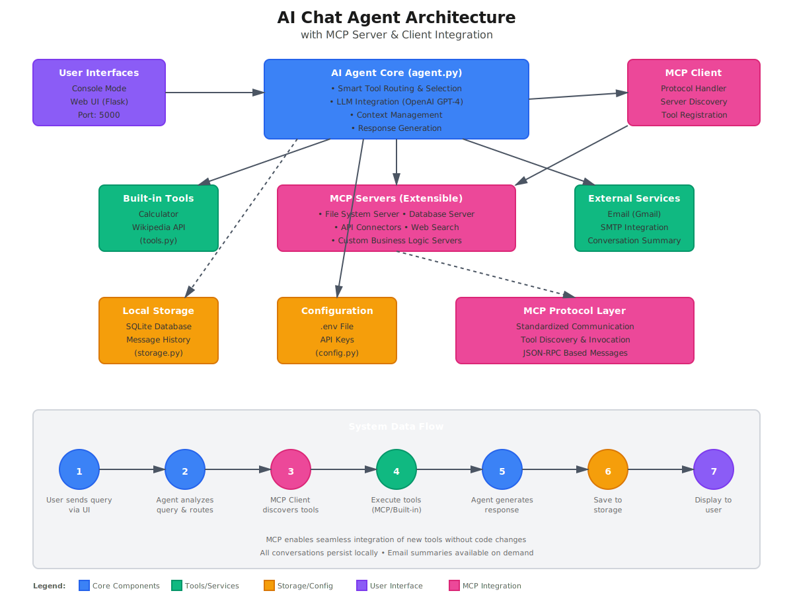

# 🤖 AI Chat Agent with MCP Integration

Smart AI agent that automatically uses Calculator and Wikipedia tools based on your questions, powered by the Model Context Protocol (MCP) for modular and extensible tool integration.

## Features

- **Smart Tool Routing**: Auto-detects when to use Calculator, Wikipedia, both, or neither
- **MCP Architecture**: Modular tool system using Model Context Protocol
- **Persistent Storage**: All conversations saved locally
- **Email Summaries**: Send conversation history via email
- **Dual Interface**: Console and Web UI
- **Extensible**: Easy to add new tools via MCP servers

## 🏗️ Architecture



The system uses a comprehensive, layered MCP-based architecture with clear separation of concerns:

### Architecture Layers

#### 1. **User Interface Layer**
- **Console Mode**: Terminal-based interactive interface
- **Web UI**: Flask-based web application (Port 5000)
- Provides dual-mode access for different user preferences

#### 2. **AI Agent Core** (`agent.py`)
- **Smart Tool Routing & Selection**: Automatically determines which tools to use
- **LLM Integration**: OpenAI GPT-4 for natural language understanding
- **Context Management**: Maintains conversation context across interactions
- **Response Generation**: Synthesizes tool outputs into coherent responses

#### 3. **MCP Client Layer**
- **Protocol Handler**: Manages MCP JSON-RPC communication
- **Server Discovery**: Automatically discovers available MCP servers
- **Tool Registration**: Registers and manages tools from multiple sources
- **Request/Response Management**: Handles tool invocation and result processing

#### 4. **Tool Execution Layer**

**Built-in Tools** (`tools.py`):
- Calculator: Mathematical computations
- Wikipedia API: Knowledge retrieval

**MCP Servers** (Extensible):
- File System Server: File operations and management
- Database Server: Data persistence and queries
- API Connectors: Third-party service integrations
- Web Search: Real-time information retrieval
- Custom Business Logic Servers: Domain-specific tools

**External Services**:
- Email Integration (Gmail SMTP)
- Conversation Summary via email
- Third-party API connections

#### 5. **Storage & Configuration Layer**
- **Local Storage** (`storage.py`): SQLite database for message persistence
- **Configuration** (`config.py`): Environment-based settings and API keys
- **MCP Protocol Layer**: Standardized communication, tool discovery, and invocation

### System Data Flow

1. **User Input**: User sends query via Console or Web UI
2. **Query Analysis**: Agent analyzes query and determines routing strategy
3. **Tool Discovery**: MCP Client discovers available tools from connected servers
4. **Tool Execution**: Executes appropriate tools (MCP servers or built-in)
5. **Response Generation**: Agent synthesizes tool outputs into natural language
6. **Persistence**: Conversation saved to local SQLite storage
7. **User Output**: Response displayed via the user's chosen interface

### MCP Integration Benefits

- **Modularity**: Clear separation between agent logic and tool implementations
- **Extensibility**: Add new tools without modifying core code
- **Interoperability**: Connect to any MCP-compatible server
- **Standardization**: JSON-RPC based protocol ensures compatibility
- **Scalability**: Multiple MCP servers can provide different tool sets
- **Independent Development**: Tools can be developed and deployed separately

## Quick Start

### 1. Install Dependencies
```bash
pip install -r requirements.txt
```

### 2. Configure Environment
Create `.env` file:
```bash
OPENAI_API_KEY=your_key_here
GMAIL_EMAIL=your_email@gmail.com          # Optional
GMAIL_PASSWORD=your_gmail_app_password    # Optional

# MCP Configuration (Optional)
MCP_ENABLED=true                           # Enable/disable MCP integration
MCP_SERVERS="stdio://python3 mcp_server.py"  # Comma-separated MCP server commands
```

### 3. Run the System
```bash
# Console mode with MCP integration
python3 main.py

# Web mode with MCP integration
python3 main.py web
```

### What Happens on Startup

The system automatically:
1. **Initializes MCP Client**: Establishes connection to configured MCP servers
2. **Discovers Available Tools**: Queries MCP servers for their tool capabilities
3. **Registers Tools**: Makes Calculator, Wikipedia, and any custom MCP tools available
4. **Loads Configuration**: Reads API keys and settings from `.env` and `config.py`
5. **Connects to Storage**: Opens SQLite database for conversation persistence
6. **Starts Interface**: Launches Console or Web UI based on your choice
7. **Routes Requests**: Intelligently routes user queries to appropriate tools via MCP protocol

## Examples

```
You: What is 156 * 23?
Agent: 156 multiplied by 23 equals 3,588.
[Tools: calculator]

You: Who was Albert Einstein?
Agent: Albert Einstein was a German-born theoretical physicist...
[Tools: wikipedia]

You: Calculate the square of the year Einstein was born
Agent: Einstein was born in 1879, and 1879² = 3,531,641.
[Tools: wikipedia, calculator]
```

## Project Structure

```
ai-chat-agent/
├── main.py               # Application entry point and orchestration
├── agent.py              # AI Agent core with LLM integration
├── tools.py              # Built-in Calculator + Wikipedia implementations
├── mcp_server.py         # MCP server exposing tools via protocol
├── mcp_client.py         # MCP client for server connections
├── mcp_integration.py    # MCP tool integration and management
├── storage.py            # SQLite-based message persistence
├── interface.py          # Console + Flask Web UI
├── config.py             # Environment configuration and settings
├── requirements.txt      # Python dependencies
└── architecture.svg      # System architecture diagram
```

### Component Descriptions

- **main.py**: Entry point that initializes all components and manages application lifecycle
- **agent.py**: Core AI agent with GPT-4 integration, context management, and response generation
- **tools.py**: Native implementations of Calculator and Wikipedia tools
- **mcp_server.py**: Standalone MCP server that exposes tools via JSON-RPC protocol
- **mcp_client.py**: Client implementation for connecting to and communicating with MCP servers
- **mcp_integration.py**: Integration layer that bridges the agent with MCP servers
- **storage.py**: Persistent storage layer using SQLite for conversation history
- **interface.py**: User interface implementations (Console CLI and Flask web server)
- **config.py**: Configuration management for API keys, MCP servers, and system settings
- **architecture.svg**: Visual architecture diagram showing system components and data flow

## MCP Configuration

### Architecture Overview

The MCP integration consists of three main components:
1. **MCP Server** (`mcp_server.py`): Exposes tools via JSON-RPC protocol
2. **MCP Client** (`mcp_client.py`): Connects to servers and manages communication
3. **MCP Integration** (`mcp_integration.py`): Bridges agent with MCP ecosystem

### Environment Variables

```bash
# Enable/Disable MCP integration
MCP_ENABLED=true                          # Set to 'false' to disable MCP

# Specify MCP servers (comma-separated connection strings)
MCP_SERVERS="stdio://python3 mcp_server.py,stdio://python3 /path/to/other/server.py"

# MCP Protocol settings
MCP_TIMEOUT=30                            # Request timeout in seconds
MCP_MAX_RETRIES=3                         # Maximum connection retry attempts
```

### Server Connection Formats

MCP supports multiple transport protocols:

```bash
# Standard I/O (stdio) - Most common for local servers
MCP_SERVERS="stdio://python3 mcp_server.py"

# Node.js MCP servers
MCP_SERVERS="stdio://node /path/to/server.js"

# Python servers with arguments
MCP_SERVERS="stdio://python3 /path/to/server.py --port 8080 --verbose"

# Multiple servers (comma-separated)
MCP_SERVERS="stdio://python3 mcp_server.py,stdio://node external_server.js,stdio://python3 /opt/custom/server.py"

# HTTP with Server-Sent Events (SSE)
MCP_SERVERS="sse://http://localhost:8080/mcp"
```

### Configuration File

Edit `config.py` to programmatically configure MCP servers:

```python
import os

# MCP Server configurations
MCP_ENABLED = os.getenv("MCP_ENABLED", "true").lower() == "true"

MCP_SERVERS = [
    # Local built-in server
    "stdio://python3 mcp_server.py",
    
    # External Python server
    "stdio://python3 /path/to/external/mcp/server.py",
    
    # Node.js server
    "stdio://node /path/to/node/mcp/server.js",
    
    # Remote HTTP server
    "sse://http://api.example.com/mcp"
]

# MCP Protocol settings
MCP_CONFIG = {
    "timeout": 30,
    "max_retries": 3,
    "enable_caching": True,
    "log_requests": True
}
```

### Available MCP Servers

**Built-in Servers**:
- `mcp_server.py`: Calculator and Wikipedia tools

**Community Servers** (examples):
- File System: `@modelcontextprotocol/server-filesystem`
- Database: `@modelcontextprotocol/server-postgres`
- Git: `@modelcontextprotocol/server-git`
- Slack: `@modelcontextprotocol/server-slack`
- GitHub: `@modelcontextprotocol/server-github`

### Tool Discovery Process

When the agent starts with MCP enabled:

1. **Connect**: MCP Client establishes connections to all configured servers
2. **List Tools**: Client queries each server for available tools using `tools/list` request
3. **Register**: Tools are registered with their schemas, descriptions, and handlers
4. **Route**: Agent automatically routes queries to appropriate tools based on context
5. **Execute**: MCP Client invokes tools via `tools/call` requests with proper arguments
6. **Respond**: Results are returned to agent for response synthesis

## Testing

### Test MCP Server Standalone
```bash
python3 mcp_server.py
```

### Test MCP Client
```bash
python3 mcp_client.py
```

### Test MCP Integration
```bash
python3 mcp_integration.py
```

### Test Full System
```bash
# With MCP enabled (default)
python3 main.py

# Without MCP (if disabled)
MCP_ENABLED=false python3 main.py
```

## Commands (Console Mode)

- Type your message to chat
- `email` - Send last 5 messages to email
- `quit` - Exit

## Web Interface

Run `python3 main.py web` and open http://localhost:5000

## Development

### Adding New MCP Tools

#### Option 1: Extend Existing MCP Server (`mcp_server.py`)

1. **Add Tool Definition**:
   ```python
   # In mcp_server.py __init__ method
   self.tools["web_search"] = {
       "name": "web_search",
       "description": "Search the web for current information",
       "inputSchema": {
           "type": "object",
           "properties": {
               "query": {
                   "type": "string",
                   "description": "Search query"
               },
               "max_results": {
                   "type": "integer",
                   "description": "Maximum results to return",
                   "default": 5
               }
           },
           "required": ["query"]
       }
   }
   ```

2. **Implement Tool Handler**:
   ```python
   # In handle_request method
   elif tool_name == "web_search":
       query = arguments.get("query", "")
       max_results = arguments.get("max_results", 5)
       
       # Your tool implementation
       results = perform_web_search(query, max_results)
       
       return {
           "content": [
               {
                   "type": "text",
                   "text": json.dumps(results)
               }
           ]
       }
   ```

3. **Update Agent Prompt** (`agent.py`):
   ```python
   SYSTEM_PROMPT = """You are an AI assistant with access to:
   - Calculator for mathematical operations
   - Wikipedia for factual information
   - Web Search for current information
   
   Use web_search when the user asks about recent events or current data."""
   ```

#### Option 2: Create Standalone MCP Server

1. **Create New Server File** (`custom_mcp_server.py`):
   ```python
   #!/usr/bin/env python3
   import json
   import sys
   from typing import Any, Dict
   
   class CustomMCPServer:
       def __init__(self):
           self.tools = {
               "my_custom_tool": {
                   "name": "my_custom_tool",
                   "description": "Description of what this tool does",
                   "inputSchema": {
                       "type": "object",
                       "properties": {
                           "param": {
                               "type": "string",
                               "description": "Parameter description"
                           }
                       },
                       "required": ["param"]
                   }
               }
           }
       
       def handle_request(self, request: Dict[str, Any]) -> Dict[str, Any]:
           method = request.get("method")
           
           if method == "initialize":
               return {
                   "protocolVersion": "2024-11-05",
                   "capabilities": {"tools": {}},
                   "serverInfo": {
                       "name": "custom-mcp-server",
                       "version": "1.0.0"
                   }
               }
           
           elif method == "tools/list":
               return {"tools": list(self.tools.values())}
           
           elif method == "tools/call":
               params = request.get("params", {})
               tool_name = params.get("name")
               arguments = params.get("arguments", {})
               
               if tool_name == "my_custom_tool":
                   # Implement your tool logic
                   result = self.execute_custom_tool(arguments)
                   return {
                       "content": [
                           {"type": "text", "text": str(result)}
                       ]
                   }
           
           return {"error": "Unknown method"}
       
       def execute_custom_tool(self, arguments: Dict[str, Any]) -> str:
           # Your custom tool implementation
           param = arguments.get("param", "")
           return f"Processed: {param}"
       
       def run(self):
           for line in sys.stdin:
               try:
                   request = json.loads(line)
                   response = self.handle_request(request)
                   print(json.dumps(response), flush=True)
               except Exception as e:
                   error_response = {"error": str(e)}
                   print(json.dumps(error_response), flush=True)
   
   if __name__ == "__main__":
       server = CustomMCPServer()
       server.run()
   ```

2. **Register in Configuration**:
   ```bash
   # In .env or config.py
   MCP_SERVERS="stdio://python3 mcp_server.py,stdio://python3 custom_mcp_server.py"
   ```

### Connecting to External MCP Servers

#### Python Servers
```bash
# Basic Python server
MCP_SERVERS="stdio://python3 /path/to/server.py"

# With virtual environment
MCP_SERVERS="stdio:///path/to/venv/bin/python /path/to/server.py"

# With command-line arguments
MCP_SERVERS="stdio://python3 /path/to/server.py --config /etc/config.json --verbose"
```

#### Node.js Servers
```bash
# NPM package server
MCP_SERVERS="stdio://npx -y @modelcontextprotocol/server-filesystem /home/user/documents"

# Local Node.js script
MCP_SERVERS="stdio://node /path/to/server.js"

# With Node environment
MCP_SERVERS="stdio://NODE_ENV=production node /path/to/server.js"
```

#### HTTP/SSE Servers
```bash
# Remote HTTP server with SSE
MCP_SERVERS="sse://https://api.example.com/mcp"

# Local HTTP server
MCP_SERVERS="sse://http://localhost:8080/mcp"

# With authentication (configure separately in server config)
MCP_SERVERS="sse://https://api.example.com/mcp"
```

#### Multiple Heterogeneous Servers
```bash
MCP_SERVERS="stdio://python3 mcp_server.py,stdio://node fs-server.js,sse://https://api.example.com/mcp,stdio://python3 /opt/custom/db-server.py"
```

### MCP Protocol Implementation

The MCP protocol uses JSON-RPC 2.0 messages:

**Initialize Connection**:
```json
{
  "jsonrpc": "2.0",
  "id": 1,
  "method": "initialize",
  "params": {
    "protocolVersion": "2024-11-05",
    "capabilities": {},
    "clientInfo": {
      "name": "ai-chat-agent",
      "version": "1.0.0"
    }
  }
}
```

**List Available Tools**:
```json
{
  "jsonrpc": "2.0",
  "id": 2,
  "method": "tools/list"
}
```

**Call a Tool**:
```json
{
  "jsonrpc": "2.0",
  "id": 3,
  "method": "tools/call",
  "params": {
    "name": "calculator",
    "arguments": {
      "expression": "25 * 4"
    }
  }
}
```

### Testing MCP Integration

#### Unit Tests
```python
# test_mcp.py
import pytest
from mcp_client import MCPClient
from mcp_integration import MCPIntegration

@pytest.mark.asyncio
async def test_mcp_client_connection():
    client = MCPClient("stdio://python3 mcp_server.py")
    await client.connect()
    assert client.is_connected()
    
@pytest.mark.asyncio
async def test_tool_discovery():
    integration = MCPIntegration()
    await integration.initialize()
    tools = await integration.list_tools()
    assert "calculator" in [t["name"] for t in tools]
    assert "wikipedia" in [t["name"] for t in tools]

@pytest.mark.asyncio
async def test_tool_execution():
    integration = MCPIntegration()
    await integration.initialize()
    result = await integration.call_tool("calculator", {"expression": "10 + 5"})
    assert "15" in result
```

#### Integration Tests
```bash
# Test MCP server standalone
python3 mcp_server.py
# Then send test requests via stdin

# Test MCP client
python3 mcp_client.py

# Test full integration
python3 -m pytest test_mcp.py -v

# Test with actual agent
python3 main.py
# Then interact and verify tool usage
```

## Troubleshooting

### MCP Connection Issues

#### Problem: "Failed to connect to MCP server"

**Diagnosis**:
```bash
# Test if server is accessible
python3 mcp_server.py
# Should start and wait for input

# Test server manually with JSON-RPC
echo '{"jsonrpc":"2.0","id":1,"method":"initialize","params":{"protocolVersion":"2024-11-05"}}' | python3 mcp_server.py
```

**Solutions**:
1. **Verify Server Path**: Ensure MCP_SERVERS paths are correct
   ```bash
   which python3  # Verify Python path
   ls -la mcp_server.py  # Verify file exists and is executable
   ```

2. **Check Dependencies**: Ensure all server dependencies are installed
   ```bash
   pip install -r requirements.txt
   python3 -c "import wikipedia; print('OK')"  # Test Wikipedia
   ```

3. **Test Standalone**: Run server independently
   ```bash
   python3 mcp_server.py  # Should not exit with error
   ```

4. **Enable Verbose Logging**: Add debug output
   ```python
   # In config.py
   MCP_CONFIG = {
       "log_requests": True,
       "debug": True
   }
   ```

### MCP Tool Discovery Issues

#### Problem: "No tools found" or "Tool not available"

**Diagnosis**:
```python
# Test tool discovery
python3 -c "
from mcp_integration import MCPIntegration
import asyncio

async def test():
    mcp = MCPIntegration()
    await mcp.initialize()
    tools = await mcp.list_tools()
    print(f'Found tools: {[t[\"name\"] for t in tools]}')

asyncio.run(test())
"
```

**Solutions**:
1. **Verify Server Implementation**: Ensure server responds to `tools/list`
2. **Check Tool Schemas**: Validate JSON schemas are properly formatted
3. **Review Logs**: Check console output for initialization errors
4. **Restart System**: Sometimes requires full restart after config changes

### MCP Tool Execution Issues

#### Problem: "Tool execution failed" or timeout errors

**Diagnosis**:
```python
# Test specific tool
python3 -c "
from mcp_integration import MCPIntegration
import asyncio

async def test():
    mcp = MCPIntegration()
    await mcp.initialize()
    result = await mcp.call_tool('calculator', {'expression': '2+2'})
    print(f'Result: {result}')

asyncio.run(test())
"
```

**Solutions**:
1. **Increase Timeout**: Adjust MCP_TIMEOUT in config
   ```python
   MCP_CONFIG = {"timeout": 60}  # Increase to 60 seconds
   ```

2. **Check Tool Arguments**: Ensure proper argument format
   ```json
   {
     "expression": "10 + 5",  // Correct
     "query": "Albert Einstein"  // For Wikipedia
   }
   ```

3. **Review Error Messages**: Check both agent and server logs
4. **Test Tool Directly**: Verify tool works outside MCP context

### Performance Issues

#### Problem: Slow responses or high latency

**Analysis**:
- MCP adds approximately 10-50ms per tool call
- Network latency for remote MCP servers
- Tool execution time varies by complexity

**Solutions**:
1. **Enable Caching**: Cache frequently used results
   ```python
   MCP_CONFIG = {"enable_caching": True}
   ```

2. **Use Local Servers**: Prefer stdio over HTTP when possible
3. **Optimize Tool Logic**: Profile and optimize slow tools
4. **Disable MCP Temporarily**: For performance testing
   ```bash
   MCP_ENABLED=false python3 main.py
   ```

### Configuration Issues

#### Problem: Environment variables not loading

**Solutions**:
1. **Verify .env File**: Must be in project root
   ```bash
   ls -la .env
   cat .env  # Check contents
   ```

2. **Check Syntax**: Ensure no spaces around `=`
   ```bash
   # Correct
   OPENAI_API_KEY=sk-xxxxx
   
   # Incorrect
   OPENAI_API_KEY = sk-xxxxx
   ```

3. **Load Order**: Restart application after changes
4. **Use Absolute Paths**: For MCP_SERVERS paths

### Debug Mode

Enable comprehensive debugging:

```python
# In config.py
import logging

# Enable debug logging
logging.basicConfig(
    level=logging.DEBUG,
    format='%(asctime)s - %(name)s - %(levelname)s - %(message)s'
)

# MCP debug configuration
MCP_CONFIG = {
    "debug": True,
    "log_requests": True,
    "log_responses": True,
    "trace_execution": True
}
```

Run with debug output:
```bash
# Console mode with debug
DEBUG=1 python3 main.py

# Redirect logs to file
python3 main.py 2>&1 | tee debug.log
```

### Common Error Messages

| Error | Cause | Solution |
|-------|-------|----------|
| `ModuleNotFoundError: mcp_client` | Missing dependencies | Run `pip install -r requirements.txt` |
| `Connection refused` | Server not running | Check MCP_SERVERS configuration |
| `Timeout waiting for response` | Slow tool execution | Increase MCP_TIMEOUT |
| `Invalid JSON-RPC response` | Protocol mismatch | Update to latest MCP protocol version |
| `Tool schema validation failed` | Invalid arguments | Check tool inputSchema |
| `Permission denied` | File access issues | Check file permissions and paths |

### Getting Help

1. **Check Logs**: Review console output and debug.log
2. **Test Components**: Isolate and test each component
3. **Verify Configuration**: Double-check all config values
4. **Review Documentation**: See MCP protocol spec
5. **Community Support**: Report issues on GitHub with:
   - Error messages
   - Configuration files
   - Steps to reproduce
   - System information

## Benefits of MCP Architecture

### Technical Benefits

- **🔌 Extensibility**: Add new tools without modifying agent core code
  - Drop in new MCP servers without recompilation
  - Tools register automatically via protocol discovery
  - No coupling between agent logic and tool implementations

- **🌐 Interoperability**: Connect to any MCP-compatible server
  - Language-agnostic: Python, Node.js, Rust, Go servers all compatible
  - Standard JSON-RPC protocol ensures compatibility
  - Community-built servers work out of the box

- **🧩 Modularity**: Clear separation of concerns
  - Agent focuses on reasoning and response generation
  - Tools focus on specific domain logic
  - MCP layer handles communication protocol
  - Storage layer independent of tool execution

- **📈 Scalability**: Horizontal scaling capabilities
  - Multiple MCP servers can run in parallel
  - Different servers can provide overlapping or specialized tools
  - Load can be distributed across server instances
  - Tools can be deployed and scaled independently

- **🔄 Independent Development**: Parallel development workflows
  - Tool developers work independently from agent developers
  - Tools versioned and deployed separately
  - Breaking changes isolated to individual servers
  - Testing can be done in isolation

- **🔒 Security**: Sandboxed tool execution
  - Tools run in separate processes
  - Failed tools don't crash the agent
  - Fine-grained permission control possible
  - Input/output validation at protocol layer

- **📊 Observability**: Built-in monitoring capabilities
  - JSON-RPC protocol enables request/response logging
  - Tool execution metrics easily tracked
  - Performance profiling at tool level
  - Error tracking and debugging simplified

### User Benefits

- **🎯 Reliability**: Fault-tolerant architecture
  - Agent continues functioning if one tool fails
  - Graceful degradation when servers unavailable
  - Automatic retry mechanisms

- **⚡ Performance**: Optimized execution
  - Asynchronous tool execution
  - Parallel tool calls when possible
  - Caching layer for repeated queries

- **🛠️ Flexibility**: Customizable tool ecosystem
  - Enable/disable tools via configuration
  - Switch between different tool implementations
  - Easy A/B testing of tool variations

## Limitations and Considerations

### Performance Considerations

- **⏱️ Async Overhead**: 
  - MCP tools run in async context, adding 10-50ms per call
  - Stdio transport has minimal overhead
  - HTTP/SSE transport adds network latency
  - **Mitigation**: Use caching, local servers, optimize tool code

- **🔗 Connection Management**:
  - Each MCP server requires persistent connection
  - More servers = more resource usage
  - Connection failures require retry logic
  - **Mitigation**: Configure timeouts, implement health checks

### Operational Considerations

- **🌍 Network Dependency**: 
  - Remote MCP servers require network connectivity
  - Network failures can disrupt tool availability
  - **Mitigation**: Use local servers for critical tools, implement fallbacks

- **📋 Protocol Complexity**: 
  - JSON-RPC protocol requires proper implementation
  - Schema validation adds complexity
  - **Mitigation**: Use well-tested client libraries, follow spec carefully

- **🐛 Debugging Challenges**:
  - Errors can occur in multiple layers (agent, MCP, tool)
  - Async errors harder to trace
  - **Mitigation**: Comprehensive logging, debug mode, isolated testing

### Development Considerations

- **📚 Learning Curve**:
  - Developers must understand MCP protocol
  - JSON-RPC and schema definitions required
  - Async programming knowledge needed
  - **Mitigation**: Good documentation, examples, starter templates

- **🔧 Tooling**:
  - Fewer debugging tools compared to direct integration
  - Testing requires MCP infrastructure
  - **Mitigation**: Build testing utilities, use MCP inspector tools

### Architectural Considerations

- **🔀 State Management**:
  - Tools are stateless by design
  - Session state must be managed by agent
  - **Mitigation**: Use storage layer, pass context in tool calls

- **⚖️ Trade-offs**:
  - More abstraction layers vs. simpler direct calls
  - Flexibility vs. slight performance overhead
  - Standardization vs. custom optimization
  - **Decision**: Choose based on project scale and requirements

## Future Enhancements

### Phase 1: Core Improvements
- **🔍 Automatic Tool Discovery**: 
  - Scan directories for MCP servers
  - Registry-based server discovery
  - Dynamic tool registration at runtime
  - Server health monitoring and auto-restart

- **💾 Advanced Caching**:
  - Intelligent result caching with TTL
  - Distributed cache support (Redis)
  - Cache invalidation strategies
  - Preemptive cache warming

- **⚖️ Load Balancing**:
  - Distribute requests across multiple MCP server instances
  - Round-robin and weighted routing
  - Automatic failover to backup servers
  - Circuit breaker pattern for failing servers

### Phase 2: Observability & Monitoring
- **📊 Tool Metrics Dashboard**:
  - Real-time performance monitoring
  - Tool usage statistics and analytics
  - Error rate tracking
  - Latency percentiles (p50, p95, p99)

- **📝 Advanced Logging**:
  - Structured JSON logging
  - Distributed tracing with correlation IDs
  - Log aggregation and search
  - Audit trail for tool executions

- **🚨 Alerting System**:
  - Tool failure notifications
  - Performance degradation alerts
  - Threshold-based warnings
  - Integration with monitoring platforms

### Phase 3: Enhanced Integration
- **🎨 GUI Configuration**:
  - Web-based MCP server management
  - Visual tool configuration editor
  - Server status dashboard
  - Tool testing interface

- **🔐 Authentication & Authorization**:
  - OAuth2 integration for remote servers
  - API key management
  - Role-based access control (RBAC)
  - Tool-level permissions

- **🌊 Streaming Responses**:
  - Server-Sent Events (SSE) for long-running tools
  - Progressive result delivery
  - Real-time status updates
  - Cancellable operations

### Phase 4: Advanced Features
- **🤖 Multi-Agent Orchestration**:
  - Specialized agents for different domains
  - Agent-to-agent communication via MCP
  - Hierarchical agent structures
  - Collaborative problem solving

- **🧠 Tool Recommendation Engine**:
  - ML-based tool suggestion
  - Context-aware routing
  - Learning from usage patterns
  - A/B testing framework

- **🔄 Workflow Automation**:
  - Multi-tool pipelines
  - Conditional execution flows
  - Error handling and retries
  - Workflow templates

### Phase 5: Enterprise Features
- **📦 Container Deployment**:
  - Docker containers for MCP servers
  - Kubernetes orchestration
  - Auto-scaling based on load
  - Blue-green deployments

- **🔒 Enhanced Security**:
  - End-to-end encryption
  - Secrets management (Vault integration)
  - Security audit logging
  - Vulnerability scanning

- **🌐 Multi-tenancy**:
  - Isolated tool environments per user
  - Resource quotas and limits
  - Usage billing and metering
  - Team collaboration features

### Phase 6: Developer Experience
- **🛠️ Development Tools**:
  - MCP server scaffolding CLI
  - Interactive testing console
  - Schema validator
  - Performance profiler

- **📚 Extended Documentation**:
  - Video tutorials
  - Interactive examples
  - Best practices guide
  - Common patterns library

- **🎓 Tool Marketplace**:
  - Community-contributed servers
  - Rating and review system
  - Installation with one command
  - Version management

### Research & Innovation
- **🔬 Experimental Features**:
  - Tool composition (combine multiple tools)
  - Natural language tool creation
  - Self-improving tools via feedback
  - Distributed tool execution

- **🌟 AI-Powered Enhancements**:
  - Automatic tool parameter optimization
  - Intelligent error recovery
  - Context-aware tool selection
  - Predictive prefetching

### Community & Ecosystem
- **👥 Community Building**:
  - Plugin ecosystem
  - Contribution guidelines
  - Developer forums
  - Monthly webinars

- **🤝 Integration Partnerships**:
  - Pre-built integrations with popular services
  - Official MCP server libraries
  - Third-party tool certifications
  - Enterprise support programs

## License

MIT